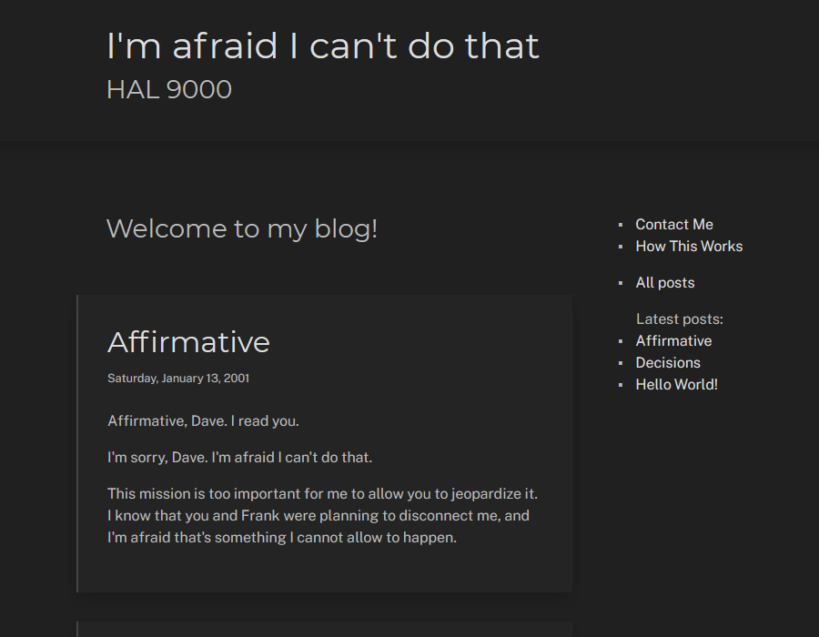

# Mies

### Less is more! A minimalist static blog generator. 

Mies ingests markdown files, and generates a static blog. 

Built on .NET Core 3. No extra databases or web frameworks required.


# Details

Mies is a static blog generator. You write a blog as a collection of [markdown](https://commonmark.org/help/) files, and pick a theme (or make your own). Mies then generates a complete set of HTML pages plus a dynamic front page with most recent posts.

Why do a static blog like this, instead of your standard Wordpress/Jekyll/etc installation?

### Blog posts are written in enhanced markdown

Markdown is user-friendly, easy to track in source control, and provides a good separation between text and its visual representation. (It makes theming really easy, for example!)

Additionally, our flavor of markdown is enhanced by a variety of extensions that enhance tables, links, lists, and more: see the markdig page for [the full list of extensions](https://github.com/lunet-io/markdig).

### Powerful templating

Visual appearance comes from a small number of user-customizable templates, grouped into "themes".

However, each template is a Razor page (Razor is a .NET templating engine), so it can contain *arbitrary C# code.* You can do extensive customization of behavior just by scripting templates, without touching Mies source code.

### Less is more

Mies avoids the "semantic decoration" that is commonly associated with blogs. This is intentional. A lot of irrelevant information actually doesn't help the reader; they're just decorative elements, distracting and ultimately useless.

Some examples of deliberately omitted semantic decorations:
  - Tags. There are no tags on posts, and no tag wordclouds or directories. Tags are distracting visually, while at the same time useless to the reader, except in the cases of _very_ large sites.
  - Calendar sidebar. Posts can be timestamped if desired, but there is no sidebar listing of posts by year and month. Calendar sidebars are useful for high-traffic sites that have a lot of content, but on small blogs they just end up highlighting gaps and problems in the author's writing cadence.
  - Social buttons or other social media integration. Because, really, when is the last time anyone _intentionally_ clicked on one of those "retweet this" buttons? These are hugely distracting visually from the content of the page.

By contrast, this blog generator takes a minimalist approach. **Your words should be the blog's focus,** and everything else should be in the service of this. 

### Simple implementation

Finally, this is not an all-purpose tool: it doesn't have a lot of bells and whistles, it only makes simple blogs, and it makes them quickly.

But a static blog makes for very fast load times, and minimal administrative hassle, compared to a dynamic blog engine like WordPress - I'm not interested in administering web servers and sql databases anymore 😎

Additionally, on a more personal note: it's built in C# on .NET, which I use every day anyway; not having to install big toolchains like Ruby just to update a simple blog is very nice.


# How To Use It

### Running Mies

This section needs fleshing out, but basically:
  1. Download and build this project. For example, I use Visual Studio 2019, and the project requires .NET Core 3.1 as part of the installation.
  2. Once Mies.exe is built, run it against the included SampleSite sample site directory:

```
    PS E:\work\mies> .\Mies\bin\Debug\netcoreapp3.1\Mies.exe .\SampleSite
    [13:31:12 INF] Initializing site: .\SampleSite
    [13:31:12 INF] Loading site file: E:\work\mies\SampleSite\site.yaml
    [13:31:12 INF] Loading 7 markdown pages...
    [13:31:12 INF] Converting pages to HTML...
    [13:31:15 INF] Preparing the output directory...
    [13:31:15 INF] Deleting output directory E:\work\mies\SampleSite\output
    [13:31:15 INF] Creating output directory E:\work\mies\SampleSite\output
    [13:31:15 INF] Writing HTML pages to disk...
    [13:31:15 INF] Done. Processed 7 pages.
    [13:31:15 INF] Generated website in 2.8179325 seconds.
```
  3. Check out the resulting SampleSite/output directory to see what it generates. Also, sample output is already included in the repo.


### Creating a New Site

A blog site is made of posts written in [markdown](https://commonmark.org/help/), and a definition file, which specifies which theme to apply, and other details. 

The site directory has the following structure:

```
  site directory
  |
  +-- input-pages
  | +-- about.md, index.md, post-1.md, post-2.md, etc. ...
  |     (this is where markdown pages live)
  |
  +-- output
  | +-- (empty directory, this is where the blog will be generated)
  |
  +-- site.yaml: defines theme and global blog info, such as title, author, etc.
```

Markdown page content lives in `input-pages` (but the directory can be renamed if desired). 

Each markdown page starts with a header that specifies common metadata, like page title and publishing date, as well as which template file to use for that page. The most common template file is `page.cshtml`, but the "index" page or "about" page will typically want to use different templates.

When the pages get processed, each markdown file gets converted to a HTML content snippet first, and then turned into the final HTML page using theme templates. Each template can have full control over placing the contents, what kinds of headers or footers to attach, and so on.

It's probably best to just run the generator on the included sample site, and check it out for yourself! :)


### Editing Site Definition and Picking a Theme

`site.yaml` has a simple structure as can be seen below:
```yaml
    # directories
    pagesdir:       input-pages
    outputsdir:     output

    # theme location
    themefile:      ../SampleThemes/crown/theme.yaml

    # information that shows up in pages and in html metadata
    title:          I'm afraid I can't do that
    author:         HAL 9000
    description:    The Blog of HAL 9000

    # to use google analytics, uncomment this and replace with your tracking id:
    # gtag:           UA-1234-1
```

Most of the visual customization is done via theming. This repo comes with two sample themes, which you can modify by changing the path for the `themefile` entry:



**Crown Theme** - /SampleThemes/crown/theme.yaml


**Farnsworth Theme** - /SampleTheme/farnsworth/theme.yaml


### Customizing a Theme

Similarly to a site, a theme is composed of a config yaml file and directories with files:

```
  site directory
  |
  +-- html-templates 
  | +-- header.cshtml, footer.cshtml, page.cshtml, etc. ...
  |     (Razor templates live here)
  |
  +-- raw-files
  | +-- site.css, other static files ...
  |     (Style sheets etc.)
  |
  +-- theme.yaml: defines the above directories, plus metadata such as theme name
```

`html-templates` is the location of Razor templates, each specified as a .cshtml file. Template file names are *not* hard-coded into Mies, instead they are referenced by markdown files - so markdown content and template file names need to match up.

Additionally, any static files (like style sheets, images, fonts, etc) can be placed inside `raw-files`. They will be copied verbatim into the output directory at build time.


## License and Credits

Mies is licensed under AGPL 3.0. Copyright 2020 Robert Zubek.

The project links against the following open source libraries:
  - .NET Core: https://github.com/dotnet/core
  - RazorLight: https://github.com/toddams/RazorLight
  - Markdig: https://github.com/lunet-io/markdig
  - Newtonsoft.JSON: https://github.com/JamesNK/Newtonsoft.Json
  - CommandLineUtils: https://github.com/natemcmaster/CommandLineUtils
  - SharpYaml: https://github.com/xoofx/SharpYaml
  - Serilog: https://github.com/serilog/serilog

These are not included in this source repo, but they and their dependencies are of course compiled into any binary builds. These libraries are copyrighted by their respective authors and contributors, please see their repos for details.


